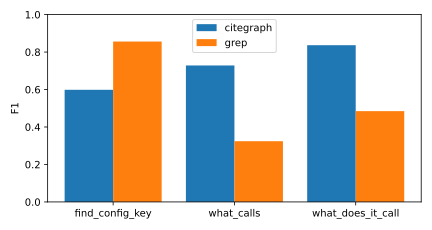
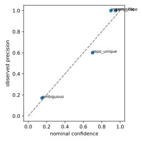
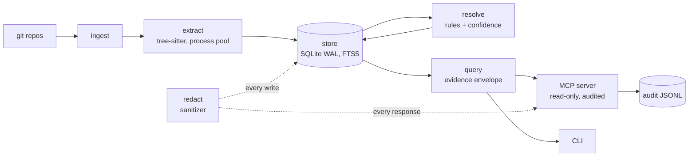

# citegraph

[](https://github.com/rankinbc/citegraph/actions/workflows/ci.yml)


**A code graph for AI coding agents that cites its evidence.** citegraph indexes a folder of git repositories and
answers structural questions over [MCP](https://modelcontextprotocol.io): *who calls this, what does it call, how does
A reach B, where is this config key set and read.* Every answer comes with `path:line` evidence, the commit it was
computed at, how it was derived, and a confidence score that was measured, not guessed.

## What it does

In plain terms: citegraph builds a map of how your code is wired together, and lets an AI coding assistant look
things up in that map instead of searching text.

1. **It reads your code.** Point it at a folder of git repositories. It parses every git-tracked Python file and records each
   function, class and method, which functions call which, what each file imports, and which configuration settings
   (environment variables, keys in JSON/YAML config files) are defined or read where. It stores names and
   locations only, never the code itself or any config values.
2. **It answers questions about that map.** It runs as a tool server that AI assistants such as Claude Code connect
   to through MCP (the Model Context Protocol, the standard way assistants call external tools). The assistant can
   then ask:
   - *Who calls this function?* and *What does this function call?*
   - *How does this endpoint end up calling that database helper?* (the shortest call chain between two functions)
   - *Where is the `PAYMENT_API_URL` setting defined, and which code reads it?*
   - *What is in this repo?* (languages, main modules, entry points, most-called functions)
3. **Every answer shows its work.** Each result lists the file and line it came from, the git commit it was computed
   at, which rule linked the two pieces of code (same file, an import, a unique name, or a name-only guess), and how
   confident that rule is, measured against a labeled test set. Low-confidence guesses are hidden unless the
   assistant asks for them, and the answer says how many were hidden. If a repo has new commits since it was
   indexed, the answer is flagged as stale.

**Before and after.** Asked who calls `flask.json.loads`, a plain text search (the eval's grep baseline) turns up 21
functions that use the name, and the assistant has to open each one to find the 5 real callers. citegraph returns exactly those 5, each with its
file, line, and a 0.9 confidence ([example below](#example)).

## Why

Ask a coding agent "what calls `place_order`?" and it greps. That works, but:

- **It is noisy.** Name matching returns every function with that name; the agent has to read each hit to sort real
  callers from look-alikes, and it repeats the work every session.
- **It cannot tell a sure answer from a guess.** A grep hit looks the same whether it is the only definition in the
  file or one of twelve functions named `check`.
- **It pulls raw source into the agent's context,** including whatever secrets happen to sit next to the match.

citegraph builds the graph once (about 3 seconds for 35k lines of Python), re-indexes only changed files, and
answers in milliseconds with structured, citable results. Each call edge records *why* it exists
(same file, through an import, unique name, ambiguous) and a confidence calibrated against a labeled eval, so an
agent can trust the 0.9 answers and know when to go read the code. The index stores names and locations only, never
source text or config values.

**Who it is for:** anyone running Claude Code or another MCP client against a multi-repo Python codebase who wants
faster, cheaper and checkable answers to "how is this wired together?"

## Example

Who calls `flask.json.loads`? Real output against flask 3.1.3, trimmed to the first of five callers and the most
useful fields:

```console
$ citegraph query what_calls symbol=flask:flask.json.loads --root ~/.citegraph/corpus/repos --name eval-corpus
{
  "data": [
    {
      "symbol": {"repo": "flask", "qualified_name": "flask.json.tag.TaggedJSONSerializer.loads",
                 "kind": "method", "path": "src/flask/json/tag.py", "line_start": 325, "line_end": 327},
      "depth": 1, "kind": "call", "rule": "import_scope", "confidence": 0.9, "candidates": 1,
      "path": "src/flask/json/tag.py", "line": 327
    },
    ... 4 more callers in tests/test_json.py (lines 75, 102, 130, 185), each import_scope at 0.9
  ],
  "evidence": [
    {"repo": "flask", "path": "src/flask/json/tag.py", "line": 327,
     "commit": "22d924701a6ae2e4cd01e9a15bbaf3946094af65"},
    ... one entry per caller
  ],
  "source": "derived",
  "confidence": 0.9,
  "stale": false,
  "notes": ["6 lower-confidence candidates hidden (rules: ambiguous); pass min_confidence=0.1 to see them"]
}
```

All five callers match the eval's golden answer. For the same question the grep baseline returned 21 functions, 5 of
them correct.

## Results

A deterministic eval asks citegraph and a grep baseline the same 50 questions about two pinned public repositories
(flask 3.1.3 and httpx 0.28.1). Full numbers: [report](eval/reports/2026-09-28/report.md) and
[analysis](eval/reports/2026-09-28/analysis.md).

| tool | questions | citegraph F1 | grep F1 | margin | citegraph P / R | grep P / R |
|---|---|---|---|---|---|---|
| `what_calls` | 20 | 0.73 | 0.69 | +0.04 | 0.80 / 0.70 | 0.63 / 1.00 |
| `what_does_it_call` | 20 | 0.84 | 0.58 | +0.26 | 0.88 / 0.84 | 0.50 / 1.00 |
| `find_config_key` | 5 | 0.60 | 0.86 | -0.26 | 1.00 / 0.46 | 0.78 / 0.98 |
| `find_path` | 5 | 0.60 | n/a | n/a | 0.60 / 0.60 | n/a |

- **Callees: a clear win.** citegraph scores higher on 11 questions, grep on 2, and 7 tie.
- **Callers: a narrow win.** citegraph scores higher on 6, grep on 5, and 9 tie.
- **Config keys: grep wins.** citegraph's config extractor misses several ways Python code sets and checks keys
  (see [Limitations](#limitations)).
- **Where the lead comes from.** Grep's recall is 1.00 on both call tools; citegraph's advantage is precision, and
  every call question it loses is a recall miss. That trade is the point: an agent reading 5 correct callers instead
  of 21 candidates spends less context and gets the right answer.
- **Speed.** Tool latency is p50 0.5 ms and p95 4.3 ms, timed in-process around the query call (not an MCP round
  trip).

Confidence is calibrated: each resolver rule's nominal confidence is checked against its observed precision.

| rule | nominal confidence | observed precision | edges |
|---|---|---|---|
| `same_file` | 0.95 | 1.00 | 26 |
| `import_scope` | 0.90 | 1.00 | 17 |
| `repo_unique` | 0.70 | 0.60 | 5 |
| `ambiguous` | 0.15 | 0.17 | 82 |

`ambiguous` started at 0.50; the first run measured 0.17, so it is now 0.15, below the default `min_confidence` of
0.5. Ambiguous edges are hidden unless a query asks for them, and the answer says how many were hidden.

 

## Quickstart

Requires Python 3.13+, git, and [uv](https://docs.astral.sh/uv/).

```bash
# 1. Index a folder of git repositories (or a single repository)
uvx --from git+https://github.com/rankinbc/citegraph citegraph index ~/src/my-repos

# 2. Register the MCP server with Claude Code
claude mcp add citegraph -- uvx --from git+https://github.com/rankinbc/citegraph citegraph serve --root ~/src/my-repos

# 3. Ask Claude Code: "what calls OrderService.place_order?"
```

Re-run step 1 after pulling changes; only changed files are re-parsed, and answers say `stale: true` when a repo
has moved past the indexed commit. The same tools are available from the command line:

```bash
uvx --from git+https://github.com/rankinbc/citegraph citegraph query what_calls symbol=place_order --root ~/src/my-repos
```

To reproduce the eval from a clone of this repository:

```bash
uv sync --all-extras
uv run citegraph eval fetch    # clones flask 3.1.3 and httpx 0.28.1 into ~/.citegraph/corpus/repos
uv run citegraph eval run --golden eval/golden/python.yaml
```

## Tools

| Tool | Answers |
|---|---|
| `status` | what is indexed, and whether each repo has moved past its indexed commit |
| `search_symbols` | fuzzy symbol search |
| `get_symbol` | one symbol, its container and children |
| `what_calls` / `what_does_it_call` | callers / callees, depth 1-3, each edge with its rule and confidence |
| `find_path` | shortest call path between two symbols |
| `find_config_key` | where a config key is defined and read (`A:B`, `A__B` and `a.b` spellings match) |
| `repo_overview` | languages, top modules, entry points, fan-in hotspots |
| `explain_edge` | why an edge exists: rule, meaning, confidence, evidence |

Every tool returns the same envelope: `data`, `evidence` (repo, path, line, commit), `source`
(parsed / derived / curated), `confidence`, `stale`, and `notes` (truncation, hidden candidates, staleness).
Errors come back as `{error, message, hint, data}`, for example an ambiguous name with its candidates.

## How it works



1. **Ingest** lists tracked files with git and skips anything unchanged since the last run (content hash).
2. **Extract** parses Python with tree-sitter in a process pool: symbols, call/import/inheritance references, and
   config key *names* from env reads, JSON, YAML, docker-compose and `.env` example files.
3. **Store** writes everything to SQLite through a single method that sanitizes every string first.
4. **Resolve** turns references into edges in a whole-graph pass. Each edge records the rule that produced it
   (same file, import scope, unique in repo, unique across repos, ambiguous), and the rule sets its confidence.
5. **Query** answers through nine read-only tools served over stdio MCP, with every response sanitized again and
   every call written to a JSONL audit log (arguments only, never results).

More detail: [architecture](docs/architecture.md), [design notes](docs/design-notes.md), [full design](docs/design.md).

## Design principles

- **Evidence, not answers.** Results carry `path:line`, commit, `source`, `confidence` and a `stale` flag. The agent
  opens code with its own tools, so its own permission rules still apply.
- **Safe by construction.** The schema has no column for source text or config values. A sanitizer runs on every
  write and every response, and the index is leak-scanned after every run.
- **Read-only and audited.** The database is opened read-only, there are no write or shell tools (the only
  subprocess is a fixed `git rev-parse HEAD` staleness check), and every call is audited (`citegraph audit stats`).
- **Measured, not claimed.** A deterministic eval with a grep baseline and confidence calibration runs in CI as a
  regression gate, and the published results include where citegraph loses.

## Code tour

A short path through the parts most worth reading:

| What | Where |
|---|---|
| Resolution rules and their confidence values | [resolve/rules.py](src/citegraph/resolve/rules.py), [resolve/resolver.py](src/citegraph/resolve/resolver.py) |
| The single, sanitizing write path | [store/db.py](src/citegraph/store/db.py) (`Store._write`) |
| Secret detection (specific patterns plus a path-aware entropy check) | [redact/sanitizer.py](src/citegraph/redact/sanitizer.py) |
| Incremental indexing, fingerprints and the post-run leak scan | [indexer.py](src/citegraph/indexer.py) |
| The evidence envelope and staleness | [query/common.py](src/citegraph/query/common.py) |
| Read-only MCP server, audit and egress sanitizing | [mcp/server.py](src/citegraph/mcp/server.py) |
| Eval runner and the grep baseline it is compared against | [evaluation/runner.py](src/citegraph/evaluation/runner.py), [evaluation/baseline_grep.py](src/citegraph/evaluation/baseline_grep.py) |
| How the eval caught a bug in its own baseline, and the honest numbers that shipped | [design notes](docs/design-notes.md), [analysis](eval/reports/2026-09-28/analysis.md) |

## Evaluation

The eval asks 50 questions (20 `what_calls`, 20 `what_does_it_call`, 5 `find_config_key`, 5 `find_path`) about
flask 3.1.3 and httpx 0.28.1, 35.6k lines of Python pinned in [eval/corpus.yaml](eval/corpus.yaml).

- **Labels.** The golden set was bootstrapped from scip-python 0.6.6 output at the pinned commits and verified
  against source by an agent, which opened the source at the referencing line of every expected entry. No human
  reviewed it. The labeling rules are in the header of [eval/golden/python.yaml](eval/golden/python.yaml).
- **Baseline.** A regex search with ripgrep word-boundary semantics that attributes each match to its enclosing
  function by indentation. `find_path` has no grep equivalent.
- **Calibration.** Each resolver rule's nominal confidence against its observed precision, over every edge returned
  for the 40 call questions, whatever its confidence.
- **Regression gate.** CI re-runs a 19-question subset on every push and fails if any tool's F1 drops more than 0.02
  below [eval/baseline.ci.json](eval/baseline.ci.json).

The first committed report overstated citegraph's lead because of a scope-tracking bug in the grep baseline. An audit
of the eval caught it before release; [analysis.md](eval/reports/2026-09-28/analysis.md) records the correction, the
calibration change and every miss by cause.

## Security model

citegraph defends against accidental exposure of secrets and source code through an agent's context and logs: the
index holds names and locations only, values that look like secrets are redacted on the way in and on the way out,
and teams can add their own patterns in `citegraph.toml`. It does not sandbox the agent: pair it with your agent's
permission rules. See [the design](docs/design.md), section 7. The leak scanner also ships as a pre-commit hook
(`citegraph-leak-scan` in [.pre-commit-hooks.yaml](.pre-commit-hooks.yaml)).

## Limitations

- **Python only in v0.1.** TypeScript and C# are next.
- **Heuristic resolution.** Dynamic dispatch, monkey-patching and calls through variables are invisible or matched by
  name, with lower confidence.
- **No receiver-type inference.** A method called on a local, a parameter or an attribute chain (`client.request`,
  `app.json.dumps`) resolves by name alone; with several same-named definitions the edge is ambiguous and hidden by
  default. This is the largest cause of lost recall in the eval.
- **`self` in nested functions and inherited methods.** `self.m()` inside a closure, or where `m` is defined on a base
  class in another file, falls back to name matching.
- **Nested package roots.** A module is named by its path from the repo root, or from a top-level `src/`. Imports into
  packages nested deeper, such as a monorepo's `services/<name>/<pkg>/` or a `backend/app/` layout, resolve only when
  the import path matches that full path; finding package roots from `pyproject.toml` or `__init__.py` is planned.
- **Re-exports are not followed.** `from flask import Response` does not reach `flask.wrappers.Response`, so one eval
  question misses all 15 callers.
- **Stoplist and candidate cap.** Common names (`close`, `add`), dunders such as `super().__init__()`, and names with
  more than 10 definitions are never matched by name alone; unless an import or the same file settles them, they stay
  unresolved rather than produce noise.
- **Config extractor scope.** Keys come from `os.getenv`, `os.environ.get` and `os.environ[...]` in Python, and from key
  names in `appsettings*.json`, `config*.json`, `*.config.yaml`, docker-compose `environment:` blocks and `.env` example
  files. Presence checks (`"X" in os.environ`), `monkeypatch.setenv`, Flask app-config keys defined in Python and TOML
  config files are missed; this is why grep wins `find_config_key`.
- **Calibration is in-sample on one corpus.** `ambiguous` was fitted and checked on the same 82 edges, `repo_unique`
  rests on 5 edges, and `cross_repo_unique` produced no edges to measure. `direct` is reserved: the resolver never
  emits it.

## Roadmap

- TypeScript and C# extractors.
- Curated cross-service edges (for example, an HTTP call from one service to another's handler).
- Package-root detection for monorepos and re-export following.
- An agent-level eval: does an agent answer better and cheaper with citegraph than with grep alone?

## License

MIT
