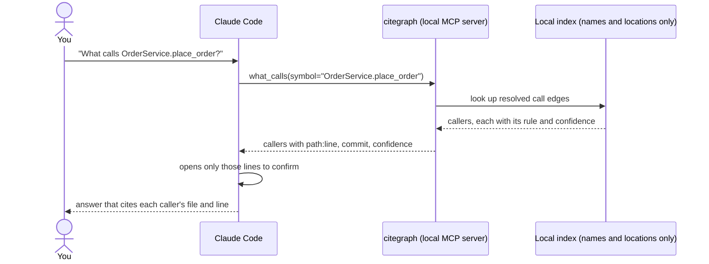

# citegraph

[](https://github.com/rankinbc/citegraph/actions/workflows/ci.yml)


**A code map for your AI coding assistant. Ask "what calls this?" or "how does this endpoint reach that code?" and
get the exact chain with file and line numbers, even when it crosses services and languages.**

citegraph reads your **Python and C#** repositories once and records which functions call which, including calls
that travel through a job queue from one service to another. It serves that map to Claude Code (or any
[MCP](https://modelcontextprotocol.io) client, such as Claude Desktop or Cursor) as a set of tools. It runs on your
machine, never returns source code, and every answer cites its evidence and says how sure it is.

## See it in action

A C# API enqueues a job. A Python worker runs it and calls into an analysis package. Three projects, two languages,
and nothing in the code a text search can follow from one end to the other:

```csharp
// components/bff/src/Api/VersionEndpoints.cs              (DramatiqTasks.ClassifyStems = "classify_stems")
await queue.EnqueueAsync(DramatiqTasks.ClassifyStems, new object[] { versionId.ToString() });
```

```python
# components/worker/app/tasks.py
@dramatiq.actor(actor_name="classify_stems")
def classify_stems(version_id):
    from audio.stems import classify_stems as classify_audio   # re-exported by audio/stems/__init__.py
    return classify_audio([version_id])
```

> **You:** How does the `ClassifyStems` endpoint end up in `classify_one`?

```text
find_path("Site.Api.Endpoints.VersionEndpoints.ClassifyStems", "audio.stems.classify.classify_one")

step                                                  project               called at                         rule          confidence
Site.Api.Endpoints.VersionEndpoints.ClassifyStems     components/bff
→ app.tasks.classify_stems                            components/worker     src/Api/VersionEndpoints.cs:7     queue_match   0.9
→ audio.stems.classify.classify_stems                 components/analysis   app/tasks.py:8                    import_scope  0.9
→ audio.stems.classify.classify_one                   components/analysis   src/audio/stems/classify.py:6     same_file     0.95
```

That is real output (the example in [tests/test_cross_service.py](tests/test_cross_service.py), shown as a table).
citegraph resolved the C# constant to its value, matched it to the Python actor with that name, and followed the
package re-export. Your assistant gets the whole chain in one call and opens only the three lines that matter.

It is just as useful inside one repo. Asked who calls `flask.json.loads` in flask 3.1.3, citegraph returns exactly
the five real callers; a text search for the name finds **21** functions, which the assistant would otherwise open
one by one to tell callers from look-alikes. In C#, calls through interfaces land on the right method because
citegraph follows the declared types of fields, parameters and locals.

## What you can ask

| Ask | Tool |
|---|---|
| "How does the `/orders` handler end up calling the database?" | `find_path` (shortest call chain, across services) |
| "What calls `charge_card`, two levels up?" | `what_calls` |
| "What does `checkout` call?" | `what_does_it_call` |
| "Which endpoint triggers the `classify_stems` job?" | `what_calls` on the job's handler |
| "Where is `PAYMENT_API_URL` defined, and what reads it?" | `find_config_key` (env vars, `appsettings.json`, YAML, `.env`) |
| "Give me an overview of the billing repo." | `repo_overview` (languages, modules, entry points, hotspots) |
| "Why do you think A calls B?" | `explain_edge` |
| Find a symbol, show one, check what is indexed | `search_symbols`, `get_symbol`, `status` |

Every answer carries `path:line` and the git commit it came from, the rule that linked the two pieces of code, and a
confidence. Name-only guesses are hidden unless asked for, and answers from an index older than the repo are
flagged as stale.

## Quick start

You need Python 3.13+, git and [uv](https://docs.astral.sh/uv/).

```bash
# 1. Install the citegraph command
uv tool install git+https://github.com/rankinbc/citegraph

# 2. Index one repo, or a folder that holds several (seconds; re-run after you pull, only changed files are re-read)
citegraph index ~/src/my-repos

# 3. Connect it to Claude Code
claude mcp add citegraph -- citegraph serve --root ~/src/my-repos
```

Then ask questions as usual; run `/mcp` in Claude Code to check that citegraph is connected. The same tools work
from the terminal: `citegraph query what_calls symbol=place_order --root ~/src/my-repos`.

**Several services in one repo?** Add `projects = "auto"` to a `citegraph.toml` in the folder you index, and each
service is indexed as its own project. Job queues (Dramatiq, with C# or Python senders) are linked automatically;
anything else, such as an HTTP call, can be declared in a `citegraph.overrides.yaml`
([guide](docs/guide.md#linking-services)).

Setup for other MCP clients, team setup, configuration and tips: [docs/guide.md](docs/guide.md).

## How it works



1. **Index.** `citegraph index` parses every git-tracked Python and C# file with tree-sitter and stores symbols,
   references, imports and config key *names* in a local SQLite file. About 3 seconds for 35k lines.
2. **Resolve.** Each reference becomes an edge through a named rule (same file, import, declared type, queue match,
   hand-written link, unique name, or a name-only guess), and the rule sets the edge's confidence.
3. **Answer.** `citegraph serve` exposes nine read-only tools over MCP, in milliseconds.

## Safe to leave connected

- Stores names and locations only, never source code or config values. The one stored value: name-shaped C#
  `const string` job names, redacted like everything else.
- Redacts anything that looks like a secret, on the way into the index and again on the way out.
- Read-only: no write or shell tools. Every call is logged locally (`citegraph audit tail`).
- Runs on your machine. Indexing and serving make no network calls; your assistant sees only the answers it asks for.

## How accurate is it?

A deterministic eval asks citegraph and a grep baseline the same 50 questions about two pinned public Python
projects (flask and httpx), with answers labeled from a compiler-grade index:

| question | citegraph F1 | grep F1 |
|---|---|---|
| what calls X | **0.78** | 0.69 |
| what does X call | **0.84** | 0.58 |
| where is config key K | 0.60 | **0.86** |

citegraph wins on precision: grep finds every caller but buries them among look-alikes. Config keys are a known weak
spot, where plain search still does better. Each rule's confidence is checked against its measured precision, and a
subset of the eval runs in CI as a regression gate. C# is not yet benchmarked. Details:
[guide](docs/guide.md#accuracy-and-evaluation), [eval report](eval/reports/2026-10-01/report.md).

## Limitations

- Python and C# only (TypeScript is next).
- Static analysis, not a compiler: dynamic dispatch, reflection and dependency-injection wiring are invisible or
  matched by name, with lower confidence.
- Python method calls on untyped variables resolve by name only, the main cause of missed callers.
- No generic type inference in C#; extension methods resolve by name.
- Links between services: Dramatiq job queues and hand-written links only; HTTP calls between services are not
  linked automatically yet.

Full list: [docs/guide.md#limitations](docs/guide.md#limitations).

## Under the hood

- **An API designed for an agent.** All nine tools return one envelope (`data`, `evidence`, `confidence`, `stale`,
  `notes`), and errors carry a hint and candidates so the agent can recover on its own.
  [mcp/server.py](src/citegraph/mcp/server.py)
- **Calibrated graph resolution.** When the eval showed name-only matches were right 17% of the time, not the
  assumed 50%, the confidence was lowered to match and those edges were hidden by default.
  [resolve/](src/citegraph/resolve)
- **Security by construction.** One sanitizing write path, a leak scan after every run, and a schema with no column
  that could hold code. [store/db.py](src/citegraph/store/db.py)
- **Honest evaluation.** The eval caught a bug in its own baseline that made citegraph look ten times better on one
  tool; the corrected numbers are the ones published. [analysis](eval/reports/2026-09-28/analysis.md)
- **Quality bar.** 350+ tests, strict pyright, ruff, CI on Ubuntu and Windows.

More: [architecture](docs/architecture.md), [design notes](docs/design-notes.md), [full design](docs/design.md).

## Roadmap

- HTTP links between services (queue links and hand-written links ship today).
- A TypeScript extractor.
- A C# eval: scip-dotnet labels, a C# golden set and grep baseline, calibrated C# confidence and a CI gate.
- An agent-level eval: does an agent answer better and cheaper with citegraph than with grep alone?

## License

MIT
