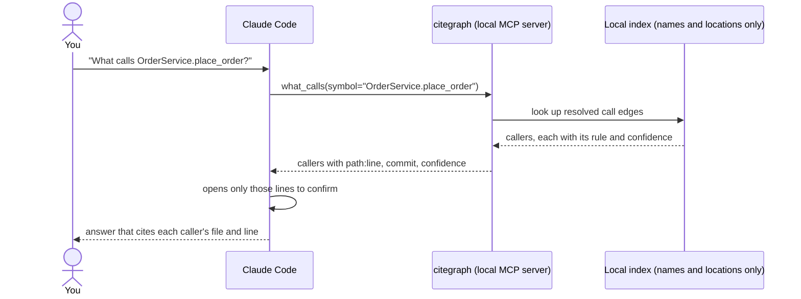

# citegraph

[](https://github.com/rankinbc/citegraph/actions/workflows/ci.yml)


**A code map for your AI coding assistant. Ask "what calls this function?" and get the exact callers, with file and
line numbers, instead of a pile of grep hits.**

citegraph reads your **Python and C#** repositories once and records which functions call which, and where each
config setting is defined and read. It then serves that map to Claude Code (or any [MCP](https://modelcontextprotocol.io)
client, such as Claude Desktop or Cursor) as a set of tools. It runs on your machine, never returns source code, and
every answer cites its evidence and says how sure it is.

## See it in action

Ask a question the way you normally would. Your assistant makes one citegraph call instead of a grep-and-read loop:

> **You:** Who calls `flask.json.loads`?

```text
what_calls("flask.json.loads")

caller                                       location                     rule          confidence
flask.json.tag.TaggedJSONSerializer.loads    src/flask/json/tag.py:327    import_scope  0.9
tests.test_json.test_jsonify_basic_types     tests/test_json.py:75        import_scope  0.9
tests.test_json.test_jsonify_dicts           tests/test_json.py:102       import_scope  0.9
tests.test_json.test_jsonify_arrays          tests/test_json.py:130       import_scope  0.9
tests.test_json.test_jsonify_uuid_types      tests/test_json.py:185       import_scope  0.9

note: 6 lower-confidence candidates hidden (rules: ambiguous); pass min_confidence=0.1 to see them
```

That is real output from flask 3.1.3, shown as a table (the raw JSON is in the [guide](docs/guide.md#tools-and-the-answer-format)).
Those are exactly the five real callers. A text search for the name finds **21** functions, and the
assistant would have to open each one to tell the real callers from look-alikes. With citegraph it opens only the
five lines that matter, and quotes them in its answer.

In C#, citegraph follows the declared types of fields, parameters and locals, so a call through an interface lands on
the right method:

```csharp
public class OrdersController
{
    private readonly IOrderService _orders;
    public Task<int> Post(int id) => _orders.PlaceOrderAsync(new Order(id));   // -> IOrderService.PlaceOrderAsync
}
```

## What you can ask

| Ask | Tool |
|---|---|
| "What calls `charge_card`, two levels up?" | `what_calls` |
| "What does `checkout` call?" | `what_does_it_call` |
| "How does the `/orders` handler end up calling the database?" | `find_path` (shortest call chain) |
| "Which endpoint triggers the `classify_stems` job, and what does that job do?" | `what_calls` / `what_does_it_call` across services (job queues, hand-written links) |
| "Where is `PAYMENT_API_URL` defined, and what reads it?" | `find_config_key` (env vars, `appsettings.json`, YAML, `.env`) |
| "Give me an overview of the billing repo." | `repo_overview` (languages, modules, entry points, hotspots) |
| "Why do you think A calls B?" | `explain_edge` |
| Find a symbol, show one, check what is indexed | `search_symbols`, `get_symbol`, `status` |

Every answer carries `path:line` and the git commit it came from, the rule that linked the two pieces of code, and a
confidence. Name-only guesses are hidden unless asked for, and answers about a repo with newer commits than its index
are flagged as stale.

## Quick start

You need Python 3.13+, git and [uv](https://docs.astral.sh/uv/).

```bash
# 1. Install the citegraph command
uv tool install git+https://github.com/rankinbc/citegraph

# 2. Index one repo, or a folder that holds several (seconds; re-run after you pull, only changed files are re-read)
citegraph index ~/src/my-repos

# 3. Connect it to Claude Code
claude mcp add citegraph -- citegraph serve --root ~/src/my-repos
```

Monorepo? Add `projects = "auto"` to a `citegraph.toml` in the folder you index, so each project is indexed with its own module names ([guide](docs/guide.md#monorepos-and-projects)).

Then ask questions as usual. Run `/mcp` in Claude Code to check that citegraph is connected. To try it without an
assistant, the same tools work from the terminal:

```bash
citegraph query what_calls symbol=place_order --root ~/src/my-repos
```

Setup for other MCP clients, team setup, configuration and tips: [docs/guide.md](docs/guide.md).

## How it works



1. **Index.** `citegraph index` parses every git-tracked Python and C# file with tree-sitter and stores symbols,
   references, imports and config key *names* in a local SQLite file. About 3 seconds for 35k lines.
2. **Resolve.** Each reference becomes an edge through a named rule (same file, import, declared type, unique name,
   or a name-only guess), and the rule sets the edge's confidence.
3. **Answer.** `citegraph serve` exposes nine read-only tools over MCP, in milliseconds.

## How accurate is it?

A deterministic eval asks citegraph and a grep baseline the same 50 questions about two pinned public Python
projects (flask and httpx), with answers labeled from a compiler-grade index:

| question | citegraph F1 | grep F1 |
|---|---|---|
| what calls X | **0.78** | 0.69 |
| what does X call | **0.84** | 0.58 |
| where is config key K | 0.60 | **0.86** |

citegraph wins on precision: grep finds every caller but buries them among look-alikes. Each rule's confidence is
checked against its measured precision, and a subset of the eval runs in CI as a regression gate. Config keys are a
known weak spot, and C# is not yet benchmarked. Details: [guide](docs/guide.md#accuracy-and-evaluation),
[eval report](eval/reports/2026-10-01/report.md).

## Safe to leave connected

- Stores names and locations only, never source code or config values. The one stored value: name-shaped C# `const string` job names, redacted like everything else.
- Redacts anything that looks like a secret, on the way into the index and again on the way out.
- Read-only: no write or shell tools. Every call is logged locally (`citegraph audit tail`).
- Runs on your machine. Indexing and serving make no network calls; your assistant sees only the answers it asks for.

## Limitations

- Python and C# only (TypeScript is next).
- Static analysis, not a compiler: dynamic dispatch, reflection and dependency-injection wiring are invisible or
  matched by name, with lower confidence.
- Python method calls on untyped variables resolve by name only, the main cause of missed callers.
- No generic type inference in C#; extension methods resolve by name.
- Links between services: Dramatiq job queues and hand-written links only; HTTP calls between services are not linked yet.

Full list: [docs/guide.md#limitations](docs/guide.md#limitations).

## Under the hood

- **An API designed for an agent.** All nine tools return one envelope (`data`, `evidence`, `confidence`, `stale`,
  `notes`), and errors carry a hint and candidates so the agent can recover on its own.
  [mcp/server.py](src/citegraph/mcp/server.py)
- **Calibrated graph resolution.** When the eval showed name-only matches were right 17% of the time, not the
  assumed 50%, the confidence was lowered to match and those edges were hidden by default.
  [resolve/](src/citegraph/resolve)
- **Security by construction.** One sanitizing write path, a leak scan after every run, and a schema with no column
  that could hold code. [store/db.py](src/citegraph/store/db.py)
- **Honest evaluation.** The eval caught a bug in its own baseline that made citegraph look ten times better on one
  tool; the corrected numbers are the ones published. [analysis](eval/reports/2026-09-28/analysis.md)
- **Quality bar.** 300+ tests, strict pyright, ruff, CI on Ubuntu and Windows.

More: [architecture](docs/architecture.md), [design notes](docs/design-notes.md), [full design](docs/design.md).

## Roadmap

- A C# eval: scip-dotnet labels, a C# golden set and grep baseline, calibrated C# confidence and a CI gate.
- A TypeScript extractor.
- HTTP links between services (queue links and hand-written links ship today).
- An agent-level eval: does an agent answer better and cheaper with citegraph than with grep alone?

## License

MIT
