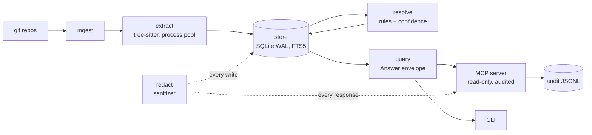

# Architecture

| Unit | Owns | Never does |
|---|---|---|
| ingest | repo discovery, tracked files, HEAD sha | read file contents |
| extract | symbols, references, imports, config key names | touch the database |
| redact | secret shapes, sanitizer, leak scan | log or print a matched value |
| store | schema, the only write path | store source text or config values |
| resolve | edges with rule and confidence | guess targets outside the index |
| query | every read, the evidence envelope | write |
| mcp | 9 tools, audit, egress sanitizing | shell out (except `git rev-parse HEAD`), write |
