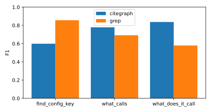
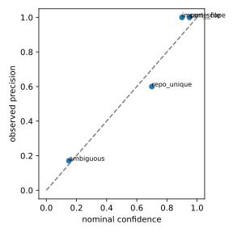

# citegraph guide

The [README](../README.md) covers what citegraph is and how to get started. This guide has the details: using it
day to day with Claude Code, the command line, configuration, the tool reference, how accuracy is measured, the
security model, and the full list of limitations.

- [Using it with Claude Code](#using-it-with-claude-code)
- [Other MCP clients](#other-mcp-clients)
- [Command line](#command-line)
- [Configuration](#configuration)
- [Monorepos and projects](#monorepos-and-projects)
- [Linking services](#linking-services)
- [Tools and the answer format](#tools-and-the-answer-format)
- [Accuracy and evaluation](#accuracy-and-evaluation)
- [Security model](#security-model)
- [Limitations](#limitations)

## Using it with Claude Code

### Setup

```bash
uv tool install git+https://github.com/rankinbc/citegraph   # once
citegraph index ~/src/my-repos                               # once, then after you pull
claude mcp add citegraph -- citegraph serve --root ~/src/my-repos
```

Start Claude Code and run `/mcp`: citegraph should be listed as connected with nine tools. To share the setup with
your team, add it with `--scope project` instead; Claude Code then writes the server entry to a `.mcp.json` file you can
commit.

### What changes in a session

Without citegraph, a question like "what calls `place_order`?" turns into a loop: Claude greps for the name, reads
each matching file to tell real callers from look-alikes, and often greps again for the next layer. With citegraph
connected, Claude makes one tool call (`what_calls`) and gets back the list of callers, each with a file, a line and a
confidence. It can then open only the lines that matter, and quote them in its answer.

When it connects, citegraph tells Claude how to use it: check `status` first, cite the evidence it returns, and open
code with its own file tools rather than expecting source text from citegraph.

### Prompts that work well

- "Before I change the signature of `charge_card`, list everything that calls it, two levels up."
- "Trace how a request to the `/orders` handler reaches the database layer."
- "We want to remove the `LEGACY_TAX_MODE` setting. Where is it defined and where is it read?"
- "I am new to this repo. Give me an overview: main modules, entry points, and the most-called functions."
- "Which of these callers are tests and which are production code?"

### Tips

- Re-index after pulling. Only changed files are re-read, so it takes seconds; a git `post-merge` hook that runs
  `citegraph index <folder>` keeps it current automatically. Answers about a repo with newer commits than its index
  are flagged as stale.
- To nudge Claude toward the graph, add a line to your project's `CLAUDE.md`, for example: "For questions about
  callers, call paths or config keys, use the citegraph tools before searching files."
- Check usage with `citegraph audit stats` (calls per tool, errors, latency) and `citegraph audit tail`.

## Other MCP clients

For Claude Desktop, Cursor and other MCP clients, add this to the client's MCP server configuration, using the
absolute path to your folder:

```json
{
  "mcpServers": {
    "citegraph": { "command": "citegraph", "args": ["serve", "--root", "/absolute/path/to/my-repos"] }
  }
}
```

## Command line

The same nine tools work from the terminal, without an assistant:

```bash
citegraph index ~/src/my-repos                                    # build or update the index
citegraph query what_calls symbol=place_order --root ~/src/my-repos
citegraph query what_does_it_call symbol=checkout depth=2 --root ~/src/my-repos
citegraph query find_config_key pattern=PAYMENT_API_URL --root ~/src/my-repos
citegraph status --root ~/src/my-repos                            # what is indexed, and whether it is out of date
citegraph audit stats                                             # every tool call is logged locally
```

A symbol can be a short name (`place_order`), a qualified name (`shop.orders.OrderService.place_order`), or
`repo:qualified.name` when two repos define the same name. If a name matches several symbols, the answer lists the
candidates.

## Configuration

An optional `citegraph.toml` in the folder you index:

```toml
languages = ["python", "csharp"]                    # the default; drop one to skip it
include = ["services/**"]                           # only index matching paths (default: everything)
exclude = ["**/legacy/**", "**/node_modules/**"]    # replaces the default exclude list
extra_redaction_patterns = ["ACME-[0-9]+"]          # your own secret formats, redacted like the built-in ones
projects = "off"                                     # "auto" or a list of folders; see Monorepos and projects

[queues]
send_methods = ["Enqueue", "EnqueueAsync"]          # C# methods whose first argument names a job
```

The default exclude list skips `node_modules`, `.venv`, `venv`, `vendor`, `dist` and `build` folders. Only
git-tracked files are read.

## Monorepos and projects

A monorepo holds several projects. By default a whole git repository is one logical repo, so a Python module in
`components/worker/app/tasks.py` is named `components.worker.app.tasks`, and the worker's own `from app.x import y`
does not match. Turn on projects in `citegraph.toml` at the folder you index:

    projects = "auto"                                   # or a list: ["components/api", "components/worker"]

With `"auto"`, a folder holding `pyproject.toml`, `setup.py`, `setup.cfg`, `requirements.txt` or a `.sln` is a project,
and so is a folder holding a `.csproj` with no `.sln` above it; the repository root never is. Each project is indexed
as its own logical repo named `<repo>/<folder>` (for example `site/components/worker`), its module names and evidence
paths start at the folder, and two projects can use the same package name. Files outside every project stay in the
repository's own logical repo.

## Linking services

**Job queues.** citegraph links a job sent to a Dramatiq queue to the function that runs it, across languages:

- Sends: C# calls named `Enqueue`/`EnqueueAsync` (configurable) whose first argument is a string literal or a
  constant (`DramatiqTasks.ClassifyStems`); Python `actor.send(...)`, `actor.send_with_options(...)` and
  `broker.enqueue(Message(actor_name="..."))`.
- Handlers: functions decorated with `@dramatiq.actor(...)`, under their `actor_name` or their own name.
- The link is an edge with rule `queue_match` (confidence 0.9); two handlers with one name give `ambiguous` edges.

To link a job named by a constant, citegraph stores that constant's value, but only `const string` values shaped
like a name (letters, digits, `_ . : -`, at most 64 characters), redacted like every other stored string.

**Hand-written links.** For anything else (an HTTP call, a message bus), add `citegraph.overrides.yaml` to any indexed
repository:

    edges:
      - from: Shop.Orders.OrderService.PlaceOrder
        to: payments:payments.api.charge
        note: HTTP POST /charge

Names are qualified names, optionally `repo:qualified.name`. Each entry is an edge with rule `curated` (confidence
1.0) whose evidence is its line in the file; `explain_edge` shows the note. `status` lists entries whose names match
no symbol or more than one (`overrides_unresolved`).

## Tools and the answer format

| Tool | Answers |
|---|---|
| `status` | what is indexed, and whether each repo has moved past its indexed commit |
| `search_symbols` | fuzzy symbol search |
| `get_symbol` | one symbol, its container and children |
| `what_calls` / `what_does_it_call` | callers / callees, depth 1-3, each edge with its rule and confidence |
| `find_path` | shortest call path between two symbols |
| `find_config_key` | where a config key is defined and read (`A:B`, `A__B` and `a.b` spellings match) |
| `repo_overview` | languages, top modules, entry points, fan-in hotspots |
| `explain_edge` | why an edge exists: rule, meaning, confidence, evidence |

Every tool returns the same envelope: `data`, `evidence` (repo, path, line, commit), `source`
(parsed / derived / curated), `confidence`, `stale`, and `notes` (truncation, hidden candidates, staleness).
Errors come back as `{error, message, hint, data}`, for example an ambiguous name with its candidates.

Full output for the README's example, trimmed to the first of five callers and the most useful fields:

```console
$ citegraph query what_calls symbol=flask:flask.json.loads --root ~/.citegraph/corpus/repos --name eval-corpus
{
  "data": [
    {
      "symbol": {"repo": "flask", "qualified_name": "flask.json.tag.TaggedJSONSerializer.loads",
                 "kind": "method", "path": "src/flask/json/tag.py", "line_start": 325, "line_end": 327},
      "depth": 1, "kind": "call", "rule": "import_scope", "confidence": 0.9, "candidates": 1,
      "path": "src/flask/json/tag.py", "line": 327
    },
    ... 4 more callers in tests/test_json.py (lines 75, 102, 130, 185), each import_scope at 0.9
  ],
  "evidence": [
    {"repo": "flask", "path": "src/flask/json/tag.py", "line": 327,
     "commit": "22d924701a6ae2e4cd01e9a15bbaf3946094af65"},
    ... one entry per caller
  ],
  "source": "derived",
  "confidence": 0.9,
  "stale": false,
  "notes": ["6 lower-confidence candidates hidden (rules: ambiguous); pass min_confidence=0.1 to see them"]
}
```

### How a reference becomes an edge

Each link between two symbols records the rule that produced it, and the rule sets its confidence:

| Rule | Meaning | Confidence |
|---|---|---|
| `same_file` | the name is defined in the same file | 0.95 |
| `import_scope` | resolved through an import or `using` | 0.9 |
| `same_namespace` | C#: the type is in the referencing namespace or a parent namespace | 0.9 (not yet calibrated) |
| `declared_type` | C#: the receiver's declared type (or a base type, up to 3 levels) has the member | 0.85 (not yet calibrated) |
| `repo_unique` | only one symbol with that name in the repo | 0.7 |
| `cross_repo_unique` | only one symbol with that name across all repos | 0.6 |
| `ambiguous` | several symbols share the name; this is one candidate | 0.15 |

Queries hide edges below `min_confidence` (default 0.5) and say how many they hid.

## Accuracy and evaluation

A deterministic eval asks citegraph and a grep baseline the same 50 questions (20 `what_calls`, 20
`what_does_it_call`, 5 `find_config_key`, 5 `find_path`) about flask 3.1.3 and httpx 0.28.1, 35.6k lines of Python
pinned in [eval/corpus.yaml](../eval/corpus.yaml). Full numbers: [report](../eval/reports/2026-10-01/report.md) and
[analysis](../eval/reports/2026-10-01/analysis.md).

| tool | questions | citegraph F1 | grep F1 | margin | citegraph P / R | grep P / R |
|---|---|---|---|---|---|---|
| `what_calls` | 20 | 0.78 | 0.69 | +0.09 | 0.85 / 0.75 | 0.63 / 1.00 |
| `what_does_it_call` | 20 | 0.84 | 0.58 | +0.26 | 0.88 / 0.84 | 0.50 / 1.00 |
| `find_config_key` | 5 | 0.60 | 0.86 | -0.26 | 1.00 / 0.46 | 0.78 / 0.98 |
| `find_path` | 5 | 0.60 | n/a | n/a | 0.60 / 0.60 | n/a |

- **Callees: a clear win.** citegraph scores higher on 11 questions, grep on 2, and 7 tie.
- **Callers: a narrow win.** citegraph scores higher on 7, grep on 4, and 9 tie.
- **Config keys: grep wins.** citegraph's config extractor misses several ways Python code sets and checks keys
  (see [Limitations](#limitations)).
- **Where the lead comes from.** Grep's recall is 1.00 on both call tools; citegraph's advantage is precision, and
  every call question it loses is a recall miss. That trade is the point: an agent reading 5 correct callers instead
  of 21 candidates spends less context and gets the right answer.
- **Speed.** Tool latency is p50 0.3 ms and p95 2.5 ms, timed in-process around the query call (not an MCP round
  trip).

Confidence is calibrated: each resolver rule's nominal confidence is checked against its observed precision.

| rule | nominal confidence | observed precision | edges |
|---|---|---|---|
| `same_file` | 0.95 | 1.00 | 26 |
| `import_scope` | 0.90 | 1.00 | 34 |
| `repo_unique` | 0.70 | 0.60 | 5 |
| `ambiguous` | 0.15 | 0.17 | 82 |

`ambiguous` started at 0.50; the first run measured 0.17, so it is now 0.15, below the default `min_confidence` of
0.5.

 

### Method

- **Labels.** The golden set was bootstrapped from scip-python 0.6.6 output at the pinned commits and verified
  against source by an agent, which opened the source at the referencing line of every expected entry. No human
  reviewed it. The labeling rules are in the header of [eval/golden/python.yaml](../eval/golden/python.yaml).
- **Baseline.** A regex search with ripgrep word-boundary semantics that attributes each match to its enclosing
  function by indentation. `find_path` has no grep equivalent.
- **Calibration.** Each resolver rule's nominal confidence against its observed precision, over every edge returned
  for the 40 call questions, whatever its confidence.
- **Regression gate.** CI re-runs a 19-question subset on every push and fails if any tool's F1 drops more than 0.02
  below [eval/baseline.ci.json](../eval/baseline.ci.json).
- **C#.** The C# rules are not yet measured; a C# eval (scip-dotnet labels, a C# golden set and grep baseline) is
  the next milestone.

To reproduce the eval from a clone of this repository:

```bash
uv sync --all-extras
uv run citegraph eval fetch    # clones flask 3.1.3 and httpx 0.28.1 into ~/.citegraph/corpus/repos
uv run citegraph eval run --golden eval/golden/python.yaml
```

The first committed report overstated citegraph's lead because of a scope-tracking bug in the grep baseline. An audit
of the eval caught it before release; [analysis.md](../eval/reports/2026-09-28/analysis.md) records the correction,
the calibration change and every miss by cause.

## Security model

citegraph defends against accidental exposure of secrets and source code through an agent's context and logs:

- The index holds names and locations only. The database schema has no column that could hold source code or
  config values.
- Values that look like secrets are redacted on the way in (every write goes through one sanitizing method) and on
  the way out (every response is sanitized again). Teams can add their own patterns in `citegraph.toml`.
- After every run, `citegraph index` scans the index's live text cells with the same rules and records the result.
  Rows deleted by a change or by new redaction rules are zeroed, merged out of the search index and, on a rewrite,
  compacted out of the file.
- The MCP server opens the database read-only, has no write or shell tools, and logs every call (arguments only,
  never results) to a local JSONL audit log.

It does not sandbox the agent: pair it with your agent's permission rules. See [the design](design.md), section 7.
The leak scanner also ships as a pre-commit hook (`citegraph-leak-scan` in
[.pre-commit-hooks.yaml](../.pre-commit-hooks.yaml)).

## Limitations

- **Languages.** Python and C#; TypeScript is next. The C# rules (`declared_type` 0.85, `same_namespace` 0.9) start
  at the values in the [C# design spec](specs/2026-10-01-csharp-design.md) and are not yet calibrated on a labeled
  C# benchmark.
- **C# specifics.** A call on a variable, parameter, field or property with a declared type resolves through that
  type and up to three levels of base types and interfaces. There is no generic type inference (`var x = Make<T>()`
  has no known type), extension methods resolve by name only, and calls made through reflection or dependency
  injection registrations are invisible. A receiver whose type is not in the index (a framework type) falls back
  to name matching.
- **Heuristic resolution.** Dynamic dispatch, monkey-patching and calls through variables are invisible or matched by
  name, with lower confidence.
- **No Python receiver-type inference.** A method called on a local, a parameter or an attribute chain
  (`client.request`, `app.json.dumps`) resolves by name alone; with several same-named definitions the edge is
  ambiguous and hidden by default. This is the largest cause of lost recall in the eval.
- **`self` in nested functions and inherited methods.** `self.m()` inside a closure, or where `m` is defined on a base
  class in another file, falls back to name matching.
- **Nested package roots.** Without `projects`, a Python module is named by its path from the repo root, or from a top-level `src/`; set `projects = "auto"` for monorepos.
- **Service links.** Dramatiq queues and hand-written links only; HTTP calls between services are not linked yet.
- **Stoplist and candidate cap.** Common names (`close`, `add`, and in C# `Add`, `ToString`, `ToListAsync` and
  similar), dunders such as `super().__init__()`, and names with more than 10 definitions are never matched by name
  alone; unless an import or the same file settles them, they stay unresolved rather than produce noise.
- **Config extractor scope.** Keys come from `os.getenv`, `os.environ.get` and `os.environ[...]` in Python;
  `IConfiguration` indexers, `GetSection`, `GetValue`, `GetConnectionString` and `Environment.GetEnvironmentVariable`
  in C#; and key names in `appsettings*.json`, `config*.json`, `*.config.yaml`, docker-compose `environment:` blocks
  and `.env` example files. Presence checks (`"X" in os.environ`), `monkeypatch.setenv`, Flask app-config keys defined
  in Python and TOML config files are missed; this is why grep wins `find_config_key`.
- **Calibration is in-sample on one corpus.** `ambiguous` was fitted and checked on the same 82 edges, `repo_unique`
  rests on 5 edges, and `cross_repo_unique` produced no edges to measure. `direct` is reserved: the resolver never
  emits it.
