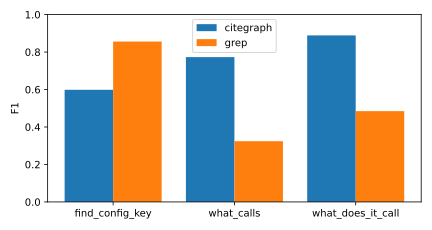
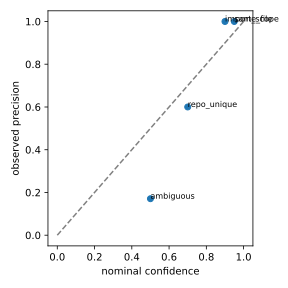

# citegraph Level-1 eval

50 questions. Tool latency p50 0.6 ms, p95 2.4 ms.

## Accuracy

| tool | questions | citegraph F1 | grep F1 | citegraph P | citegraph R |
|---|---|---|---|---|---|
| find_config_key | 5 | 0.60 | 0.86 | 1.00 | 0.46 |
| find_path | 5 | 0.80 | n/a | 0.80 | 0.80 |
| what_calls | 20 | 0.77 | 0.69 | 0.76 | 0.87 |
| what_does_it_call | 20 | 0.89 | 0.58 | 0.88 | 0.96 |

## Calibration

| rule | nominal confidence | observed precision | edges |
|---|---|---|---|
| same_file | 0.95 | 1.00 | 26 |
| import_scope | 0.90 | 1.00 | 17 |
| repo_unique | 0.70 | 0.60 | 5 |
| ambiguous | 0.50 | 0.17 | 82 |

## Misses

- `py-what_calls-flask-3`: missing [], extra ['flask:examples.tutorial.flaskr.create_app', 'flask:flask.app.Flask.__init__', 'flask:flask.sansio.blueprints.Blueprint.add_url_rule', 'flask:flask.sansio.blueprints.Blueprint.register', 'flask:flask.sansio.blueprints.BlueprintSetupState.add_url_rule', 'flask:flask.sansio.scaffold.Scaffold.route.decorator', 'flask:tests.test_async._async_app', 'flask:tests.test_basic.test_disallow_string_for_allowed_methods', 'flask:tests.test_basic.test_multi_route_class_views.View.__init__', 'flask:tests.test_basic.test_no_setup_after_first_request', 'flask:tests.test_basic.test_provide_automatic_options_kwarg', 'flask:tests.test_basic.test_url_mapping', 'flask:tests.test_cli.TestRoutes.app', 'flask:tests.test_cli.TestRoutes.test_host', 'flask:tests.test_cli.TestRoutes.test_subdomain', 'flask:tests.test_helpers.TestUrlFor.test_url_for_with_scheme_not_external', 'flask:tests.test_helpers.TestUrlFor.test_url_with_method', 'flask:tests.test_json.test_jsonify_basic_types', 'flask:tests.test_json.test_jsonify_uuid_types', 'flask:tests.test_views.test_basic_view', 'flask:tests.test_views.test_endpoint_override', 'flask:tests.test_views.test_explicit_head', 'flask:tests.test_views.test_implicit_head', 'flask:tests.test_views.test_init_once', 'flask:tests.test_views.test_method_based_view', 'flask:tests.test_views.test_methods_var_inheritance', 'flask:tests.test_views.test_multiple_inheritance', 'flask:tests.test_views.test_remove_method_from_parent', 'flask:tests.test_views.test_view_decorators', 'flask:tests.test_views.test_view_inheritance', 'flask:tests.test_views.test_view_patching', 'flask:tests.test_views.test_view_provide_automatic_options_attr', 'flask:tests.type_check.typing_route']

- `py-what_calls-flask-4`: missing [], extra ['flask:flask.sansio.app.App.register_blueprint', 'flask:flask.sansio.blueprints.Blueprint.register', 'flask:tests.test_logging.reset_logging']

- `py-what_calls-flask-6`: missing ['flask:flask.json.tag.TaggedJSONSerializer.tag'], extra []

- `py-what_calls-flask-7`: missing [], extra ['flask:flask.config.Config.from_prefixed_env', 'flask:flask.sessions.SecureCookieSessionInterface.open_session', 'flask:tests.test_basic.test_json_dump_dataclass', 'flask:tests.test_json.test_json_customization.CustomProvider.loads', 'flask:tests.test_json_tag.test_custom_tag', 'flask:tests.test_json_tag.test_dump_load_unchanged']

- `py-what_calls-flask-8`: missing ['flask:flask.json.dumps'], extra ['flask:flask.sessions.SecureCookieSessionInterface.save_session', 'flask:tests.test_json_tag.test_custom_tag', 'flask:tests.test_json_tag.test_dump_load_unchanged']

- `py-what_calls-flask-10`: missing ['flask:tests.test_basic.test_make_response_with_response_instance', 'flask:tests.test_basic.test_max_cookie_size', 'flask:tests.test_basic.test_max_cookie_size.index', 'flask:tests.test_basic.test_response_types.from_response_headers', 'flask:tests.test_basic.test_session_vary_cookie.vary_cookie_header_set', 'flask:tests.test_basic.test_session_vary_cookie.vary_header_set', 'flask:tests.test_helpers.TestStreaming.test_async_view.index', 'flask:tests.test_helpers.TestStreaming.test_stream_keeps_session.index', 'flask:tests.test_helpers.TestStreaming.test_streaming_with_context.index', 'flask:tests.test_helpers.TestStreaming.test_streaming_with_context_and_custom_close.index', 'flask:tests.test_helpers.TestStreaming.test_streaming_with_context_as_decorator.index', 'flask:tests.test_views.test_explicit_head.Index.head', 'flask:tests.test_views.test_implicit_head.Index.get', 'flask:tests.type_check.typing_app_decorators.after_async', 'flask:tests.type_check.typing_app_decorators.after_sync'], extra []

- `py-what_calls-httpx-1`: missing ['httpx:httpx._client.Client.close'], extra []

- `py-what_calls-httpx-8`: missing [], extra ['httpx:tests.client.test_async_client.test_patch']

- `py-what_does_it_call-flask-2`: missing [], extra ['flask:flask.sansio.app.App._check_setup_finished', 'flask:flask.sansio.blueprints.Blueprint._check_setup_finished']

- `py-what_does_it_call-flask-4`: missing ['flask:flask.sansio.app.App.__init__'], extra ['flask:flask.blueprints.Blueprint.send_static_file', 'flask:flask.sansio.blueprints.Blueprint.add_url_rule', 'flask:flask.sansio.blueprints.BlueprintSetupState.add_url_rule', 'flask:flask.sansio.scaffold.Scaffold.add_url_rule']

- `py-what_does_it_call-flask-6`: missing [], extra ['flask:flask.templating.DispatchingJinjaLoader.list_templates']

- `py-what_does_it_call-flask-9`: missing [], extra ['flask:flask.sansio.app.App.add_url_rule', 'flask:flask.sansio.blueprints.Blueprint.add_url_rule', 'flask:flask.sansio.blueprints.BlueprintSetupState.add_url_rule']

- `py-what_does_it_call-httpx-3`: missing ['httpx:httpx._urls.QueryParams.add'], extra []

- `py-find_config_key-flask-1`: missing ['flask:src/flask/app.py:627', 'flask:tests/conftest.py:21', 'flask:tests/test_helpers.py:345'], extra []

- `py-find_config_key-flask-2`: missing ['flask:tests/conftest.py:22'], extra []

- `py-find_config_key-flask-3`: missing ['flask:tests/test_cli.py:579'], extra []

- `py-find_config_key-httpx-1`: missing ['httpx:tests/conftest.py:24'], extra []

- `py-find_config_key-flask-4`: missing ['flask:examples/tutorial/flaskr/__init__.py:11', 'flask:src/flask/app.py:183', 'flask:src/flask/sansio/app.py:216', 'flask:tests/conftest.py:49', 'flask:tests/static/config.toml:2', 'flask:tests/test_config.py:10', 'flask:tests/test_config.py:112', 'flask:tests/test_config.py:116', 'flask:tests/test_config.py:120', 'flask:tests/test_config.py:124', 'flask:tests/test_config.py:137'], extra []

- `py-find_path-flask-1`: missing ['flask:flask.app.Flask.__init__', 'flask:flask.helpers.get_debug_flag', 'flask:flask.sansio.app.App.__init__', 'flask:flask.sansio.app.App.make_config'], extra []
